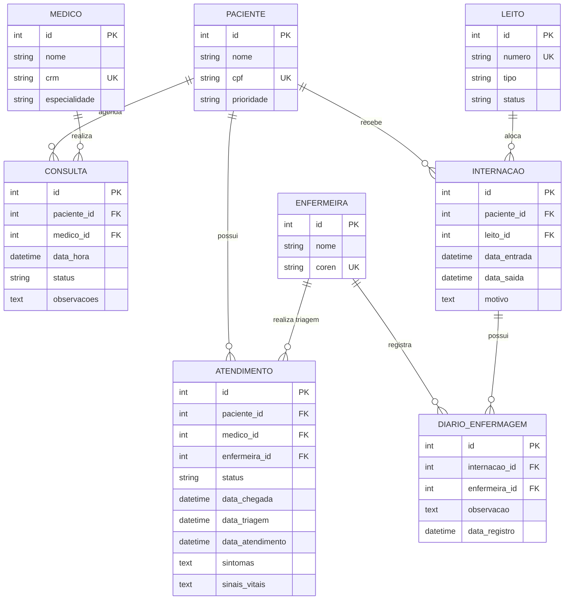

# 📊 Modelo Entidade-Relacionamento (MER) - Sistema Hospitalar V2 (Expandido)

---
**Nota:** Este diagrama reflete a arquitetura expandida com Gestão Clínica, Rodízio de Enfermagem e Evolução Diária.
