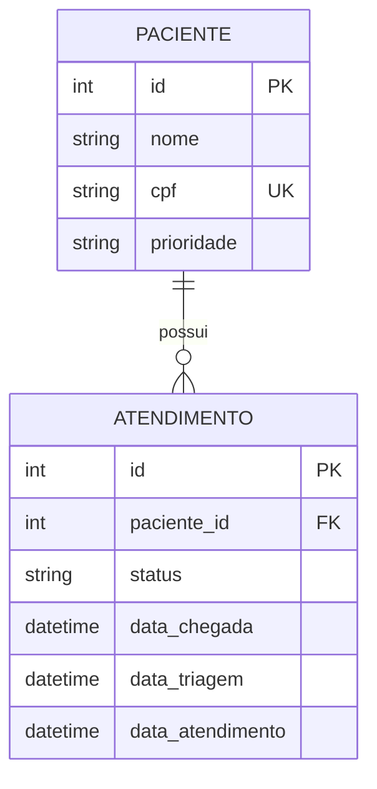

# 📊 Modelo Entidade-Relacionamento (MER) - Sistema Hospitalar

```mermaid
erDiagram
    PACIENTE ||--o{ ATENDIMENTO : "possui"

    PACIENTE {
        int id PK
        string nome
        string cpf UK
        string prioridade
    }

    ATENDIMENTO {
        int id PK
        int paciente_id FK
        string status
        datetime data_chegada
        datetime data_triagem
        datetime data_atendimento
    }
```

---
**Nota:** Este diagrama utiliza a sintaxe **Mermaid**, que é renderizada automaticamente no **GitHub** e no **Obsidian**.
