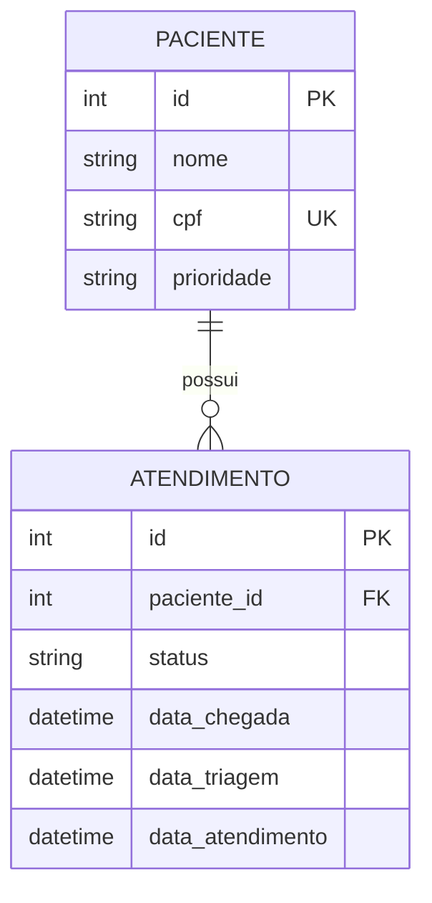

# Sistema Hospitalar - Gestão de Atendimento 🏥

Sistema de gestão de fluxo de pacientes desenvolvido em Python com **Streamlit**, focado em organizar a jornada do paciente desde a recepção até o atendimento médico final.

## 🚀 Funcionalidades

- **Recepção:** Cadastro de pacientes e registro automático na fila de triagem.
- **Central de Status:** Interface unificada para profissionais realizarem triagem e finalizarem consultas médicas através de um sistema de Cards interativos.
- **Dashboard Analítica:** Visualização de KPIs em tempo real, incluindo Total de Pacientes, Tempo Médio de Espera e Volume de Atendimentos por período.
- **Indicador de Ocupação:** Barra de progresso dinâmica que monitora a lotação da clínica em tempo real.
- **Segurança de Dados:** Sistema de exclusão de pacientes com limpeza automática de histórico (Integridade Referencial).

## 🛠️ Tecnologias Utilizadas

- **Linguagem:** Python 3.x
- **Framework Web:** [Streamlit](https://streamlit.io/)
- **Banco de Dados:** SQLite
- **Manipulação de Dados:** [Pandas](https://pandas.pydata.org/)
- **Componentes de UI:** [Streamlit-Extras](https://extras.streamlit.app/) e [Streamlit-Option-Menu](https://github.com/victoryhb/streamlit-option-menu)

## 📊 Modelo Entidade-Relacionamento (MER)

O banco de dados foi modelado para garantir um fluxo contínuo e rastreável. Abaixo está a representação visual das tabelas:



## 📦 Como Instalar e Rodar

1. **Clone o repositório:**
   ```bash
   git clone git@github.com:plfrancisco/Hospital_Atendimento.git
   cd Hospital_Atendimento
   ```

2. **Instale as dependências:**
   ```bash
   pip install streamlit pandas streamlit-extras streamlit-option-menu
   ```

3. **Inicie a aplicação:**
   ```bash
   streamlit run main.py
   ```

## 📂 Estrutura do Projeto (MVC)

O projeto segue a arquitetura **Model-View-Controller** para melhor organização:

- `Models/`: Definição das classes de dados.
- `Views/`: Interfaces visuais separadas por módulos.
- `Controllers/`: Lógica de negócio e manipulação do banco de dados.
- `Services/`: Scripts de infraestrutura e conexão com SQLite.

---
Desenvolvido como projeto de laboratório para estudos de arquitetura de software e análise de dados.
